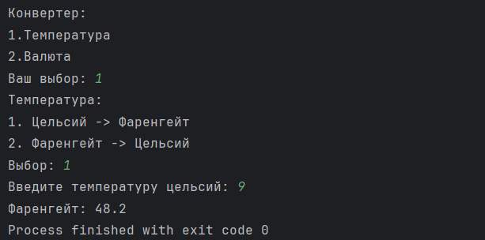

# Конвертер валют / температуры (Java)

Простой консольный проект на Java, который позволяет конвертировать температуры и валюты.

**Навыки:** switch, Scanner, методы.  
**Идеи:**
- Конвертация Цельсий ↔ Фаренгейт
- Конвертация Рубли ↔ Доллары / Евро
- Ввод с проверкой и обработкой ошибок

# Пример работы программы

Вот пример вывода в терминале:

